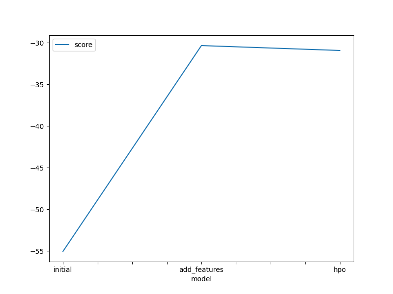
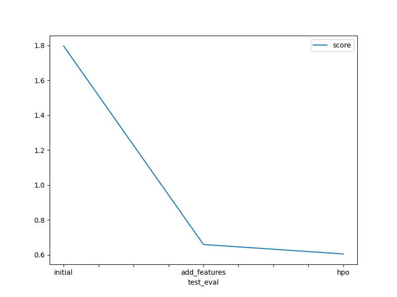

# Report: Predict Bike Sharing Demand with AutoGluon Solution
#### NAME Miguel de la Fuente

## Initial Training
### What did you realize when you tried to submit your predictions? What changes were needed to the output of the predictor to submit your results?
I had to set negative values to zero

### What was the top ranked model that performed?
It was "WeightedEnsemble_L3"

## Exploratory data analysis and feature creation
### What did the exploratory analysis find and how did you add additional features?
I found that two columns could be categorical and I also split the date column to add additional features

### How much better did your model preform after adding additional features and why do you think that is?
It improves but not as much as I expected

## Hyper parameter tuning
### How much better did your model preform after trying different hyper parameters?
It improves a lot. It gets to 0.60 from 1.83

### If you were given more time with this dataset, where do you think you would spend more time?
I think I would have spent more time playing with the hyperparameters so I could the performance of the model

### Create a table with the models you ran, the hyperparameters modified, and the kaggle score.
|model|hpo1|hpo2|hpo3|score|
|--|--|--|--|--|
|initial|n_neighbors=5|n_estimators=100|learning_rate=0.3|1.84278|
|add_features|n_neighbors=5|n_estimators=100|learning_rate=0.3|1.83730|
|hpo|n_neighbors=10|n_estimators=300|learning_rate=0.3|0.60567|

### Create a line plot showing the top model score for the three (or more) training runs during the project.

### Create a line plot showing the top kaggle score for the three (or more) prediction submissions during the project.

TODO: Replace the image below with your own.

## Summary
TODO: Add your explanation
